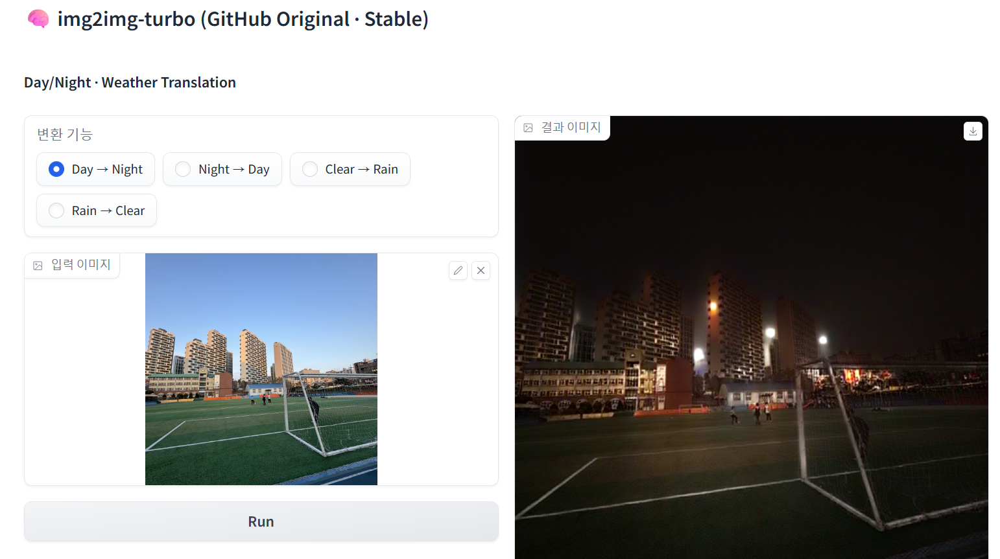
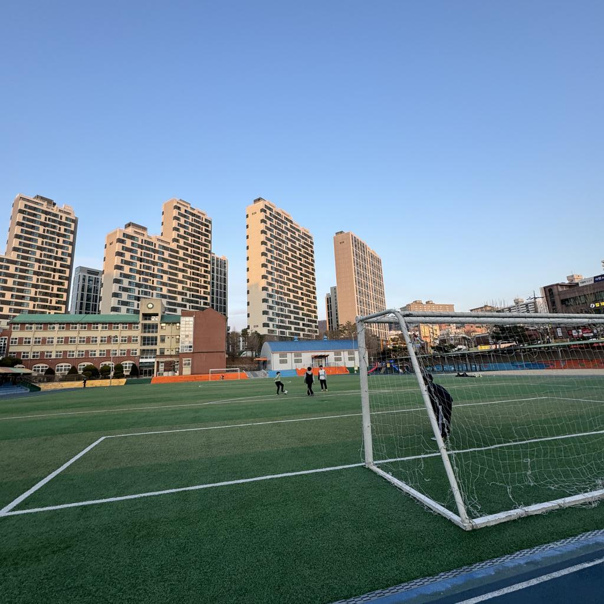
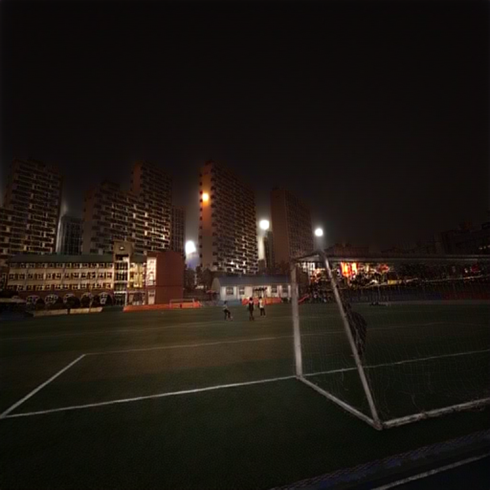
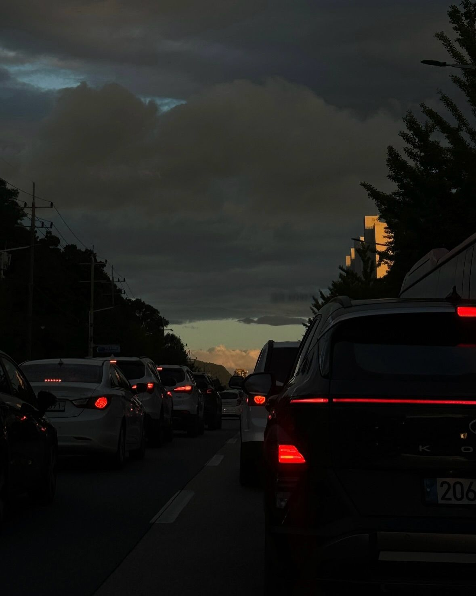
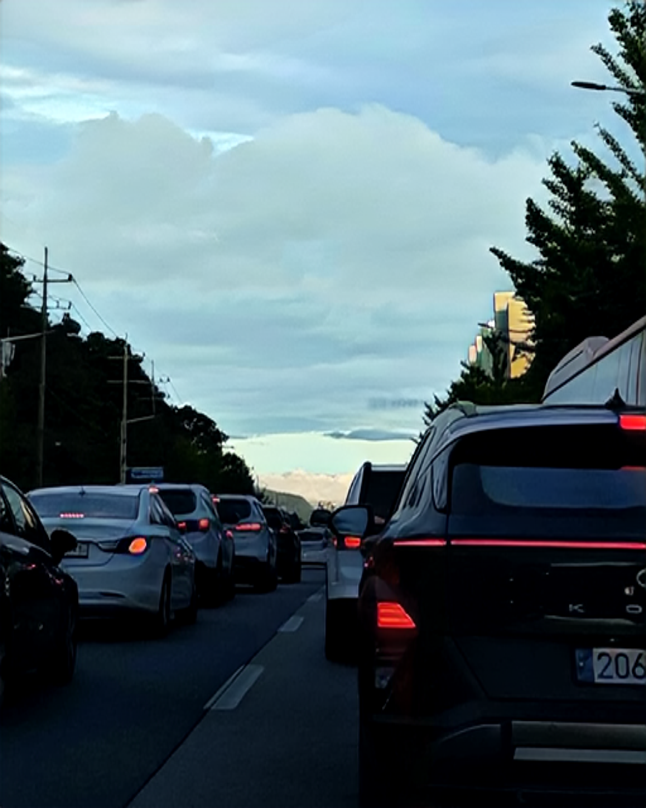
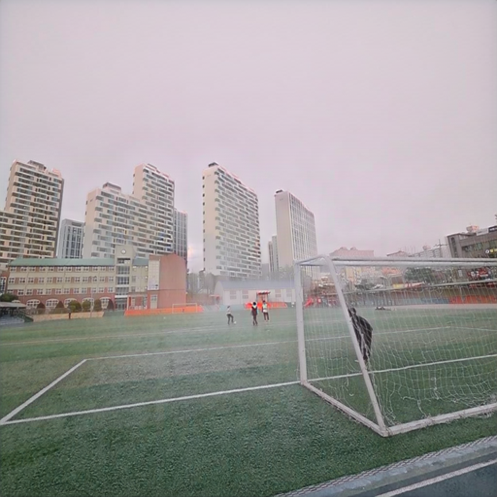
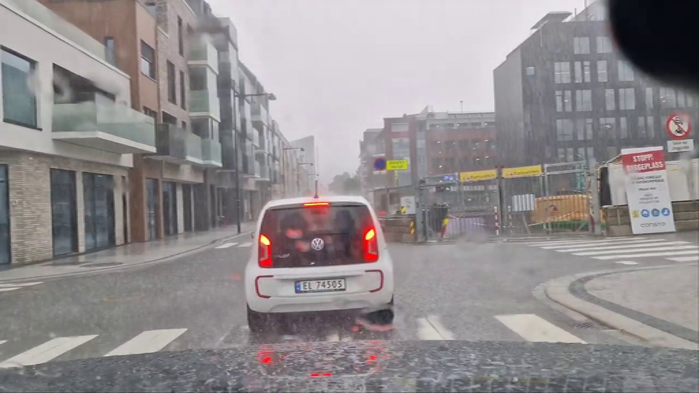
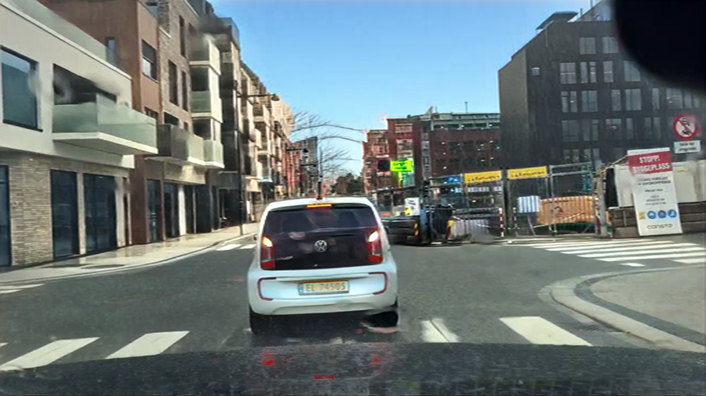

# img2img-turbo 기반 환경 변환 이미지 생성 프로젝트

## 1. 프로젝트 개요

본 프로젝트는 **img2img-turbo** GitHub 저장소에 공개된  
**CycleGAN-Turbo / pix2pix-turbo 사전학습 모델**을 활용하여  
이미지의 환경(낮/밤, 날씨)을 변환하는 이미지-to-이미지(Image-to-Image) 변환 시스템을 구현하는 것을 목표로 한다.

사용자는 하나의 이미지 입력만으로  
- 낮 → 밤  
- 밤 → 낮  
- 맑음 → 비  
- 비 → 맑음  

과 같은 **환경 변화 결과 이미지를 생성**할 수 있다.

본 프로젝트는 **추가 학습 없이 사전학습 모델을 활용한 추론(Inference)** 중심으로 진행되었다.

---

## 2. 프로젝트 배경 및 필요성

이미지는 정보 전달과 의사결정에 중요한 역할을 한다.
그러나 동일한 장소나 객체라도
촬영 시간, 날씨, 조명 조건에 따라
전혀 다른 인상을 주는 문제가 존재한다.
이로 인해 데이터 부족이나 환경 편향 문제가 발생하며,
특정 조건의 이미지를 확보하는 데 많은 비용과 시간이 소요된다.

예를 들어,
야간 환경의 데이터를 확보하거나
비 오는 날의 이미지를 수집하는 것은
현실적으로 쉽지 않으며 반복 촬영에도 한계가 있다.
이러한 문제는
컴퓨터 비전 모델 학습뿐만 아니라
콘텐츠 제작, 시뮬레이션, 도시 분석 등 다양한 분야에서 제약 요소로 작용한다.

본 프로젝트는 이러한 문제를 해결하기 위해
기존 이미지를 기반으로
환경 조건을 변환하는 Image-to-Image 기술을 적용하였다.
특히 빠른 추론 속도를 제공하는 Turbo 계열 모델을 활용하여
실제 활용 가능한 수준의 이미지 변환 시스템을 구현함으로써,
데이터 확장과 시각적 시뮬레이션의 효율성을 높이고자 한다.

---

## 3. 사용 모델 및 기술

### 3.1 img2img-turbo

- Stable Diffusion Turbo 기반
- 단일 step(one-step) 추론 구조
- 기존 Diffusion 대비 매우 빠른 추론 속도

### 3.2 CycleGAN-Turbo (Unpaired)

- Paired 데이터 없이 학습된 환경 변환 모델
- 입력과 출력의 구조를 유지하면서 스타일(환경)만 변화
- 본 프로젝트의 핵심 모델

### 3.3 pix2pix-turbo (Paired)

- Canny Edge → Image 변환용
- 본 최종 프로젝트에서는 **환경 변환 기능에 집중하기 위해 제외**

---

## 4. 구현 기능 (최종)

본 프로젝트에서는 **총 4가지 환경 변환 기능**을 하나의 UI로 통합하였다.

| 기능 | 설명 |
|----|----|
| Day → Night | 낮 이미지를 밤 이미지로 변환 |
| Night → Day | 밤 이미지를 낮 이미지로 변환 |
| Clear → Rainy | 맑은 날씨를 비 오는 환경으로 변환 |
| Rainy → Clear | 비 오는 환경을 맑은 날씨로 변환 |

> 모든 기능은 **단일 이미지 입력만으로 동작**하며  
> 추가 프롬프트 입력 없이도 변환이 가능하다.

---

## 5. 시스템 구조

1. 사용자가 이미지 업로드
2. 선택한 변환 기능에 따라 모델 자동 로드 (Lazy Loading)
3. 이미지 전처리 (Resize, Normalize)
4. CycleGAN-Turbo 모델 추론
5. 결과 이미지 출력

---

## 6. 구현 환경

- OS: Windows 11
- GPU: NVIDIA GeForce RTX 4070
- Python: 3.9
- Framework: PyTorch
- UI: Gradio

---

## 7. 실행 방법

### 7.1 실행 환경

* Python 3.9
* PyTorch
* CUDA 지원 GPU 권장
* Anaconda 가상환경 사용

### 7.2 가상환경 활성화

```bash
conda activate img2img
```

### 7.3 실행 명령어

```bash
python gradio_all_in_one.py
```

정상적으로 실행되면 터미널에 아래와 같은 메시지가 출력된다.

```
Running on local URL: http://127.0.0.1:7860
```

웹 브라우저에서 해당 주소로 접속하면 UI를 사용할 수 있다.

|     **UI 화면**      |    **업로드와 결과**     |
|:---------------------------:|:---------------------:|
|  |  |

---

## 9. 실험 결과
- Day 사진은 금광동에 위치한 금상초등학교라는 학교에서 찍었던 사진이다.
- 나머지 사진은 pinterest 사이트에서 사진을 수집했다.

### 9.1 Day → Night 변환
|     **Day**      |    **Night**     |
|:---------------------------:|:---------------------:|
|  |  |

* 낮 이미지의 밝기가 감소하며 야간 분위기로 변환
* 하늘 영역이 어두워지고 조명 효과가 자연스럽게 표현됨
* 야외 풍경 이미지에서 특히 좋은 성능을 보임

### 9.2 Night → Day 변환
|     **Night**      |    **Day**     |
|:---------------------------:|:---------------------:|
|  |  |
* 어두운 이미지를 밝은 주간 이미지로 변환
* 가로등, 차량 불빛 등 일부 요소는 잔존할 수 있음
* 원본 이미지의 정보량에 따라 결과 품질 차이 발생

### 9.3 Clear → Rain 변환
|     **Clear**      |    **Rain**     |
|:---------------------------:|:---------------------:|
|  |  |
* 전체 색감이 차분해지고 흐린 날씨 느낌으로 변화
* 대비가 줄어들며 비 오는 분위기 연출

### 9.4 Rain → Clear 변환
|     **Rain**      |    **Clean**     |
|:---------------------------:|:---------------------:|
|  |  |
* 흐린 이미지가 밝고 선명한 톤으로 변화
* 채도 및 대비가 증가하여 맑은 날씨 효과 확인

---

## 10. 결과 분석

* 모든 변환은 **사전학습 모델 기반 추론만으로 수행**
* Paired 데이터 없이도 환경 변환이 가능함을 확인
* 입력 이미지가 현실적인 경우 결과 품질이 높음
* 실내 사진이나 정보가 부족한 이미지에서는 한계 존재

---

## 11. 한계점

* Night → Day 변환 시 매우 어두운 이미지에서는 성능 저하
* 변환 강도를 조절할 수 있는 파라미터 제공 불가
* 실내 이미지에서는 환경 변화 효과가 제한적

---

## 12. 향후 개선 방향

* 입력 이미지 밝기 보정 전처리 추가
* 사용자 조절 옵션 (강도 슬라이더 등) UI 확장
* 눈, 안개 등 추가 환경 변환 모델 적용
* 단일 이미지가 아닌 영상 프레임 변환으로 확장

---

## 13. 결론

본 프로젝트는 img2img-turbo GitHub에 공개된
CycleGAN-Turbo 사전학습 모델을 활용하여
환경 변환 이미지 생성 시스템을 성공적으로 구현하였다.

추가 학습 없이도
낮/밤, 날씨 변화와 같은 시각적 환경 변환이 가능함을 확인하였으며,
딥러닝 기반 이미지 변환 기술의 실용성과 한계를 함께 분석할 수 있었다.

본 프로젝트는
딥러닝 모델을 실제 응용 관점에서 활용했다는 점에서 의미가 있다.

---
